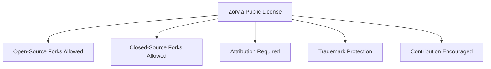
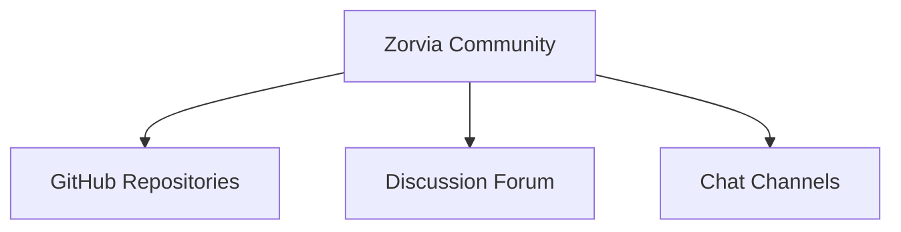

# Zorvia

**Open. Free. Collaborative.**  

Zorvia is a **community-driven organization** building software and tools that are **permissive, open-source friendly, and suitable for both open and closed-source derivatives**. Our mission is to empower developers, learners, and creators through **collaboration, transparency, and innovation**.

---

## Repository Status

[](https://github.com/Zorvia/stargazers)  
[](https://github.com/Zorvia/network/members)  
[](https://github.com/Zorvia/graphs/contributors)  
[](https://github.com/Zorvia/issues)  
[](LICENSE.md)  

---

## Mission

- **Open & Collaborative:** Projects welcome contributions of all skill levels.  
- **Permissive & Flexible:** Code can be reused in open-source or closed-source forks.  
- **Innovation & Learning:** Encourage experimentation and knowledge sharing.  
- **Inclusive & Respectful:** Diverse contributors strengthen the community.

---

## Organization Structure

```mermaid
graph TD
    A[Zorvia Organization] --> B[Core Projects]
    A --> C[Community Projects]
    A --> D[Documentation & Learning]

    B --> B1[Foundational Libraries]
    B --> B2[Utility Tools]

    C --> C1[Contributor-Initiated Projects]
    C --> C2[Collaborative Experiments]

    D --> D1[Guides & Tutorials]
    D --> D2[Educational Resources]
````

---

## Contribution Workflow

```mermaid id="76sbc7"
graph LR
    F[Fork & Clone Repository] --> G[Review Contribution Guidelines]
    G --> H[Make Changes / Add Features]
    H --> I[Open Pull Request]
    I --> J[Code Review & Discussion]
    J --> K[Merge into Main]
```

* Contributions include **code, documentation, bug reports, feature requests, or community support**.
* Engage via **Issues, Pull Requests, and Discussion Channels**.

---

## Licensing

All projects are licensed under the **[Zorvia Public License (ZPL) v1.0](LICENSE.md)**:

* **Permissive:** Suitable for open-source and closed-source derivatives.
* **Attribution:** Must credit Zorvia and contributors.
* **Trademark Protection:** Logos and names require permission.
* **Contribution Encouragement:** Contributions back are optional but recommended.



---

## Community Channels



* GitHub: [https://github.com/Zorvia](https://github.com/Zorvia)
* Chat / Community: https://discord.gg/qwMxFje28M

> “Built by the community, for the community.”

---

## Code of Conduct

All contributors must adhere to the **[Zorvia Code of Conduct](CODE_OF_CONDUCT.md)** to maintain a **friendly, professional, and inclusive environment**.

